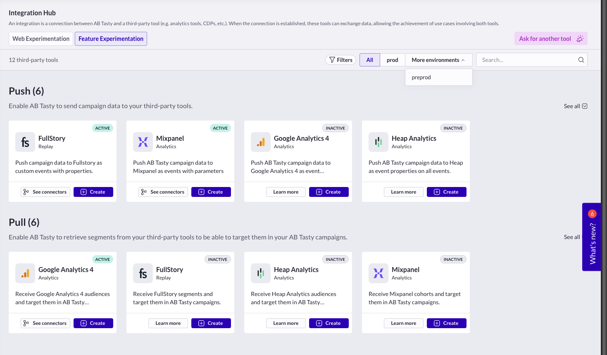
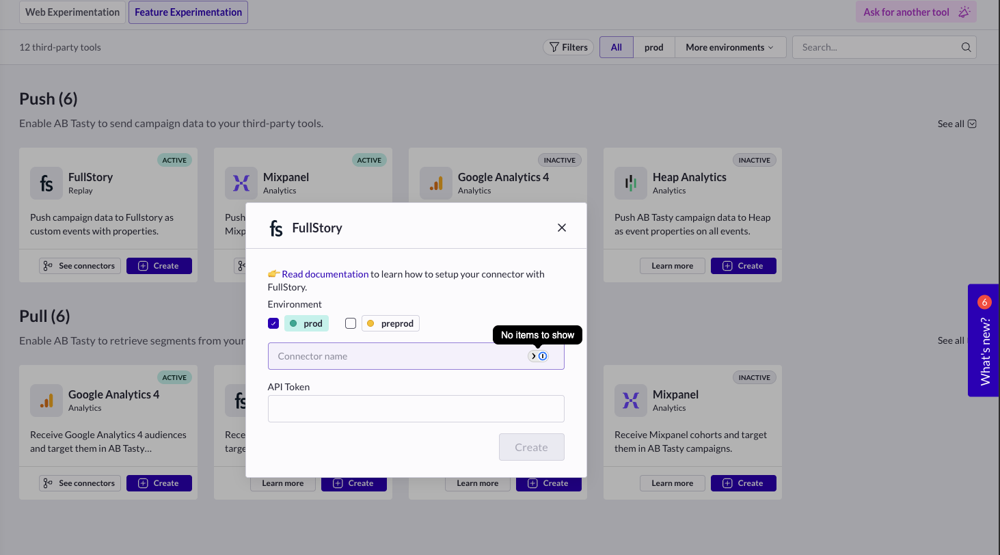
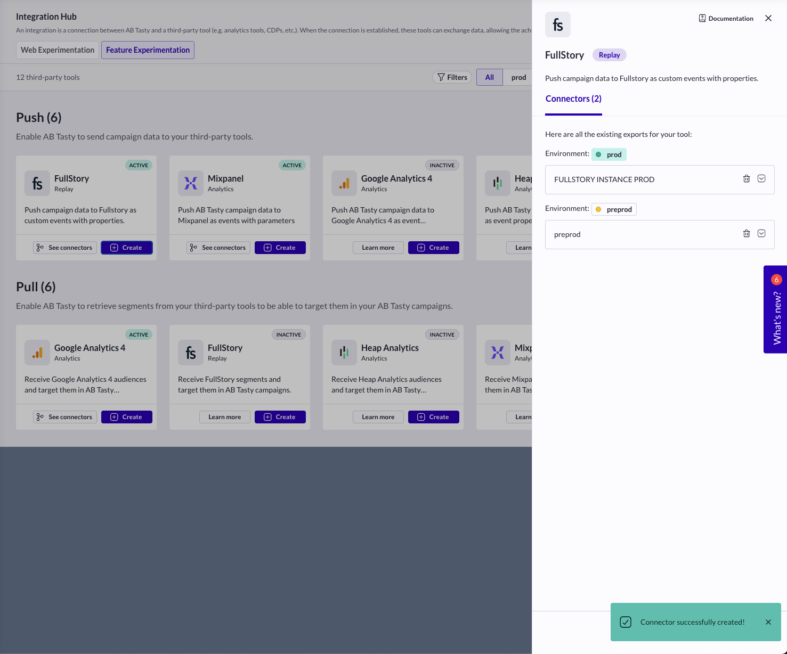

# Technical Test – Senior React Developer

Build a mini integrations hub using the provided APIs.

### Requirements

- [PNPM](https://pnpm.io/installation)
- [Node.js](https://nodejs.org/en/download/) (v22.x or higher)

## Setup

1. Run `pnpm install` to install dependencies
2. Run `pnpm --parallel dev` to start both the backend and frontend servers

Base URL: `http://localhost:3000`  
Available endpoints:

- `GET /environments`
- `GET /connectors/:environmentId`

## Tasks

  

### 1. Environment Selector

- Show a dropdown with all environments
- "All" must be the first and default option
- The selected environment should persist on page reload

### 2. Connector Cards

For each connector, display a card with:

- Name
- Description
- Icon
- Secondary button:
  - "See instances" if the connector has instances
  - "Learn more" if it doesn't
- Primary "Create" button

### 3. Filtering by Environment

- Selecting an environment should filter connectors data accordingly

### 4. Create Instance Modal

On clicking "Create", show a modal with:

- Connector name and icon
- Form including:
  - Environment radio buttons (with the selected environment as default. When `All` is selected, environment should be
    the first proposition)
  - Instance name input
  - Dynamic fields from the connector's `configs`
  - Submit button
- On submission, the instance should be created, the modal should close and the instance should be included in the list
  of all instances.

### 5. Connector Details Modal

On clicking "See instances" or "Learn more", show a modal with:

- Connector name and description
- "Create instance" button
- It should adapt based on the selected environment: only show instances for the selected environment and hide the
  others
- When `All` is selected, show all instances for all environments

## Evaluation Criteria

- TypeScript code quality is the primary focus
- React is mandatory; other libraries are allowed
- External resources permitted (excluding AI tools)
- UI design is not judged, but explain your UX decisions
